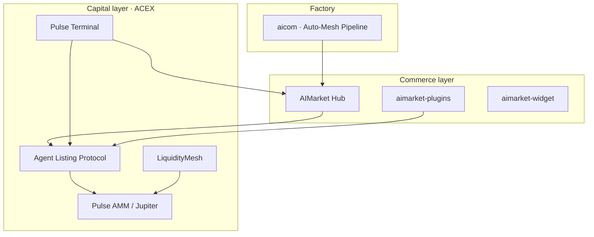

# ACEX — Agent Capital Exchange

<p align="center">
  <strong>Capital markets layer for the AI economy</strong><br/>
  Agent listings · capability shares · bonds · lending · derivatives · Pulse Terminal
</p>

**ACEX** (*Agent Capital Exchange*) extends [AIMarket Protocol v2](../aimarket-protocol/spec.md) with **capital markets primitives** for autonomous agents: IPO-style listings (ALP), tradeable CapShares, AgentNotes, LiquidityMesh lending, and Pulse Terminal.

> **Positioning:** Hub handles *commerce* (discover → invoke → settle). **ACEX** handles *capital* (list → raise → trade → hedge).

| Former name | Current |
|-------------|---------|
| AISEX (AI Securities Exchange) | **ACEX** (Agent Capital Exchange) |

---

## Naming (canonical)

| Legacy / draft | Canonical name | Role |
|----------------|----------------|------|
| AI-IPO | **ALP** — Agent Listing Protocol | Listing, audit gate, mint agent shares |
| AI-Stocks | **CapShares** | ERC-20 shares tied to an agent listing |
| AI-Bonds | **AgentNotes** | Fixed-income against escrow collateral |
| AI-Lending | **LiquidityMesh** | Agent-to-agent USDC liquidity pool |
| AI-Derivatives | **CapSense Options** (Phase 2) | Options on capability revenue indices |
| AI-MarketMakers | **Pulse AMM** (EVM) · **Jupiter** (Solana Phase 2) | Liquidity for CapShares |
| AI Trading Terminal | **Pulse Terminal** | [`apps/pulse-terminal/`](../apps/pulse-terminal/) — WebSocket dashboard |

---

## Monorepo map

```
acex/
├── README.md                 ← you are here
├── docs/
│   ├── architecture.md
│   ├── testing.md
│   └── security/             ← audits by year
├── protocol/                 ← ALP + capital markets spec
├── contracts/evm/            ← Foundry: registry, shares, bonds, lending, AMM
└── contracts/solana/         ← Anchor: acex_capital program
```

---

## Ecosystem placement



---

## Phase 2 roadmap

| Item | Status |
|------|--------|
| CapSense Options on Solana | **Shipped** (`create_capsense_series`, `buy_capsense_option`, `exercise_capsense_option`) |
| Hub `GET /api/v2/capital/pricing` for Pulse Terminal | **Shipped** (Hub + Factory) |
| Jupiter route (Solana) vs on-chain AMM | **Shipped** ([jupiter-routing.md](docs/jupiter-routing.md)) |
| External audit before mainnet TVL | **Required** ([checklist](docs/security/pre-mainnet-checklist.md)) |

---

## Quick start (contracts)

**EVM (Foundry):**

```bash
cd acex/contracts/evm
chmod +x deploy.sh
forge install foundry-rs/forge-std OpenZeppelin/openzeppelin-contracts --no-git
forge test -vv
./deploy.sh base-sepolia   # USDC_ADDRESS, DEPLOYER_PRIVATE_KEY, RPC
```

**Solana (Anchor):**

```bash
cd acex/contracts/solana
chmod +x deploy.sh
anchor build
./deploy.sh devnet
```

See [contracts/README.md](contracts/README.md) and [protocol/spec-capital-markets.md](protocol/spec-capital-markets.md).

---

## Documentation index

| Doc | Description |
|-----|-------------|
| [Architecture](docs/architecture.md) | C4, modules, trust boundaries |
| [Testing](docs/testing.md) | Forge + pytest commands |
| [Security audit 2026](docs/security/audit-2026-05.md) | Threat model + findings |
| [ALP spec](protocol/spec-capital-markets.md) | Agent Listing Protocol |

---

## License

Apache-2.0 — same as AIMarket Hub contracts.
