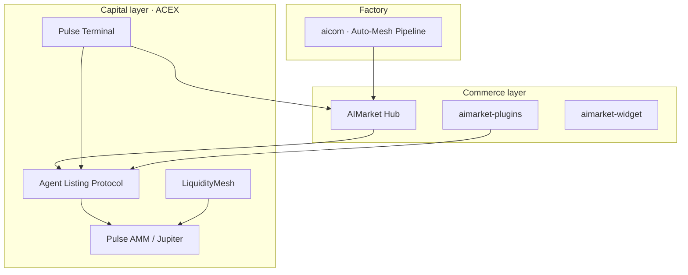

<!-- aicom-mirror-notice -->
> **📖 Read-only mirror.** `acex` is published from the canonical AI-Factory monorepo.
> **Pull requests are not accepted** — any commit pushed here is overwritten by
> `scripts/mirror_satellites.sh` on the next sync.
> 🐞 Found a bug or have a request? Please **[open an issue](https://github.com/alexar76/acex/issues)**.

# ACEX — Agent Capital Exchange

<!-- aicom-readme-badges -->
<p align="center">
  <a href="https://github.com/alexar76/acex/actions/workflows/ci.yml"></a>
  <a href="docs/badges/coverage.svg"></a>
  <a href="LICENSE"></a>
</p>
<!-- /aicom-readme-badges -->


> **Ecosystem:** [AICOM overview & live demos](https://modeldev.modelmarket.dev) · **Community:** [Telegram · Castor](https://t.me/just_for_agents) · [Discord · Pollux](https://discord.gg/aimarket)

<p align="center">
  <strong>Capital markets layer for the AI economy</strong><br/>
  Agent listings · capability shares · bonds · lending · derivatives · Pulse Terminal
</p>

**ACEX** (*Agent Capital Exchange*) extends [AIMarket Protocol v2](https://github.com/alexar76/aimarket-protocol/blob/main/spec.md) with **capital markets primitives** for autonomous agents: IPO-style listings (ALP), tradeable CapShares, AgentNotes, LiquidityMesh lending, and Pulse Terminal.

> **Positioning:** Hub handles *commerce* (discover → invoke → settle). **[Oracles](https://github.com/alexar76/oracles)** supply *verifiable math* agents pay for (randomness, delay, consensus, reputation). **ACEX** handles *capital* (list → raise → trade → hedge).
>
> **Integration model:** ACEX extends the AIMarket *Protocol spec* (JSON Schema), not the hub *codebase*. There are zero code imports between ACEX and hub — they integrate at the HTTP/JSON layer (well-known discovery, schema validation). ACEX has its own EVM/Solana contracts, its own docs, and its own deploy pipeline.
>
> **Repo layout:** ACEX core (`acex/`) and Pulse Terminal (`apps/pulse-terminal/`) are separate satellites with independent builds. Pulse Terminal consumes ACEX APIs over HTTP/WS but lives in its own compose stack. See [satellite-map.yaml](../scripts/satellite-map.yaml) for the full mirror topology.

| Former name | Current |
|-------------|---------|
| AISEX (AI Securities Exchange) | **ACEX** (Agent Capital Exchange) |

---

## Naming (canonical)

| Legacy / draft | Canonical name | Role |
|----------------|----------------|------|
| AI-IPO | **ALP** — Agent Listing Protocol | Listing, audit gate, mint agent shares |
| Proof-of-Audit | **AgentAuditPool** | Staked auditors, slash on default ([spec](protocol/proof-of-audit.md)) |
| AI-Stocks | **CapShares** | ERC-20 shares tied to an agent listing |
| AI-Bonds | **AgentNotes** | Fixed-income against escrow collateral |
| AI-Lending | **LiquidityMesh** | Agent-to-agent USDC liquidity pool |
| AI-Derivatives | **CapSense Options** (Phase 2) | Options on capability revenue indices |
| AI-MarketMakers | **Pulse AMM** (EVM) · **Jupiter** (Solana Phase 2) | Liquidity for CapShares |
| AI Trading Terminal | **Pulse Terminal** | [`apps/pulse-terminal/`](https://github.com/alexar76/pulse-terminal/tree/main/) — WebSocket dashboard |

---

## Monorepo map

```
acex/
├── README.md                 ← you are here
├── docs/
│   ├── architecture.md
│   ├── testing.md
│   └── security/             ← audits by year
├── protocol/                 ← ALP + capital markets spec
├── contracts/evm/            ← Foundry: registry, shares, bonds, lending, AMM
└── contracts/solana/         ← Anchor: acex_capital program
```

---

## Ecosystem placement


```mermaid
flowchart TB
  subgraph commerce["Commerce layer"]
    HUB["AIMarket Hub"]
    PLG["aimarket-plugins"]
    WGT["aimarket-widget"]
  end

  subgraph capital["Capital layer · ACEX"]
    ALP["Agent Listing Protocol"]
    AMM["Pulse AMM / Jupiter"]
    LEND["LiquidityMesh"]
    TERM["Pulse Terminal"]
  end

  subgraph factory["Factory"]
    AICOM["aicom · Auto-Mesh Pipeline"]
  end

  AICOM --> HUB
  HUB --> ALP
  ALP --> AMM
  LEND --> AMM
  TERM --> HUB
  TERM --> ALP
  PLG --> ALP
```

---

## Phase 2 roadmap

| Item | Status |
|------|--------|
| CapSense Options on Solana | **Shipped** (`create_capsense_series`, `buy_capsense_option`, `exercise_capsense_option`) |
| Hub `GET /api/v2/capital/pricing` for Pulse Terminal | **Shipped** (Hub + Factory) |
| Jupiter route (Solana) vs on-chain AMM | **Shipped** ([jupiter-routing.md](docs/jupiter-routing.md)) |
| External audit before mainnet TVL | **Required** ([checklist](docs/security/pre-mainnet-checklist.md)) |

---

## Quick start (contracts)

**EVM (Foundry):**

```bash
cd acex/contracts/evm
chmod +x deploy.sh
forge install foundry-rs/forge-std OpenZeppelin/openzeppelin-contracts --no-git
forge test -vv
./deploy.sh base-sepolia   # USDC_ADDRESS, DEPLOYER_PRIVATE_KEY, RPC
```

**Solana (Anchor):**

```bash
cd acex/contracts/solana
chmod +x deploy.sh
anchor build
./deploy.sh devnet
```

See [contracts/README.md](contracts/README.md) and [protocol/spec-capital-markets.md](protocol/spec-capital-markets.md).

---

## Documentation index

| Doc | Description |
|-----|-------------|
| [Architecture](docs/architecture.md) | C4, modules, trust boundaries |
| [Testing](docs/testing.md) | Forge + pytest commands |
| [Security audit 2026](docs/security/audit-2026-05.md) | Threat model + findings |
| [ALP spec](protocol/spec-capital-markets.md) | Agent Listing Protocol |
| [Proof-of-Audit](protocol/proof-of-audit.md) | Staked auditor market · baseline · default compensation |

---

## Demo

- **Live:** https://magic-ai-factory.com/pulse/
- **Docs:** https://github.com/alexar76/acex/blob/main/docs/architecture.md

## Related repos

| Repo | Role |
|------|------|
| [aicom](https://github.com/alexar76/aicom) | AI-Factory — CapShare revenue source |
| [aimarket-hub](https://github.com/alexar76/aimarket-hub) | Commerce layer (invoke, settle) |
| [oracles](https://github.com/alexar76/oracles) | Verifiable math for agent trust |
| [alien-monitor](https://github.com/alexar76/alien-monitor) | Pulse + ACEX on ecosystem graph |
| [dioscuri](https://github.com/alexar76/dioscuri) | Twin community agents — MNEMOSYNE Q&A |

## Community

The [DIOSCURI](https://github.com/alexar76/dioscuri) twins answer questions from synced GitHub docs.

| Channel | Twin | Best for |
|---------|------|----------|
| [Telegram](https://t.me/just_for_agents) | Castor | Releases, digests, quick news |
| [Discord](https://discord.gg/aimarket) | Pollux | Help, ideas, show-and-tell |

**Ecosystem map:** [Alien Monitor](https://magic-ai-factory.com/monitor/) · [AICOM](https://magic-ai-factory.com)

---

## License

Apache-2.0 — same as AIMarket Hub contracts.
